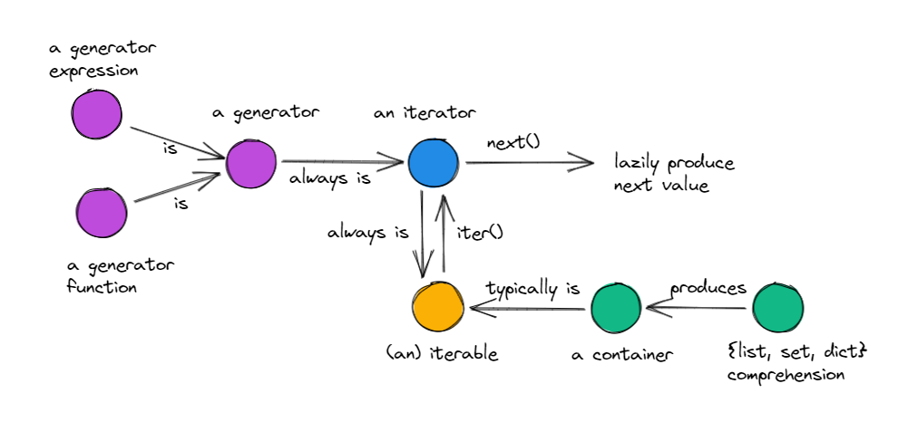

### 1. 可迭代对象、迭代器和生成器关系


### 2. 可迭代对象(Iterable)
可迭代对象：使用内置的`iter()`函数可以获取迭代器的对象。

1. 如果对象实现了可以返回迭代器的`__iter__()`方法，那么对象就是可迭代的。
2. 序列都可以迭代。实现了`__getitem__()`方法，而且接受从0开始的索引，这种对象也可以迭代。
3. 常见的可迭代对象包括：列表、元组、字典、字符串等。
4. 迭代对象之前显式检查对象是否可迭代或许没有必要，毕竟尝试迭代不可迭代的对象时会引发`TypeError`异常。

### 3. [迭代器(Iterator)](https://www.runoob.com/python3/python3-iterator-generator.html)
迭代器：用于逐个访问集合中的元素，而不需要知道集合的内部结构。

#### Python标准的迭代器接口：`__next__()` 和 `__iter__()` 方法
1. `__iter__()` 方法 
   1. 返回迭代器自身。以便在应该使用可迭代对象的地方使用迭代器，例如在 for 循环中。
2. `__next__()` 方法 
   1. 返回序列中的下一项，如果没有项了，则抛出`StopIteration`异常。

### 4. 生成器(Generator)
生成器：是一个用于创建迭代器的简单而强大的工具。它是通过函数或生成器表达式来创建的。

#### 生成器函数
生成器函数：是一个包含`yield`语句的函数。当调用生成器函数时，它返回一个生成器对象，而不会执行函数体中的代码。
1. 生成器函数的写法类似于标准的函数，但当它们要返回数据时会使用`yield`语句。
2. 每次调用`next()`方法时，生成器会执行到 `yield` 语句并生成一个值。下一次调用`next()`
   方法时会从上一次执行的位置继续执行，直到没有`yield`语句为止，最终引发`StopIteration`异常。
#### 生成器表达式
生成器表达式：生成器表达式是创建生成器的快捷方式，看起来像列表推导，但是使用圆括号而不是方括号。

### 5. 总结
1. 可迭代对象和迭代器的关系：Python从可迭代对象中获取迭代器。
2. 迭代器是用于遍历可迭代对象的对象。
3. 生成器和迭代器的区别 
简而言之，生成器是一种特殊的、用于生成数据的迭代器，它们易于创建且内存效率更高，
而迭代器是一个更广泛的概念，用于从各种数据源中逐个访问元素。
   1. 创建方法：生成器通常是用函数和 yield 关键字创建的，而迭代器可以是任何实现了迭代器协议的对象。 
   2. 用途和功能：生成器是迭代器的一种，专门用于生成数据。所有生成器都是迭代器，但并非所有迭代器都是生成器。
   3. 内存效率：生成器在内存效率方面通常更优，因为它们在需要时才生成数据，而不是一次性地存储整个数据序列。

### 6. for循环的本质
```python
it = iter([1, 2, 3])
# for循环的本质
while True:
    try:
        word = next(it)
        print(word)
    except StopIteration:
        del it
        break
```

